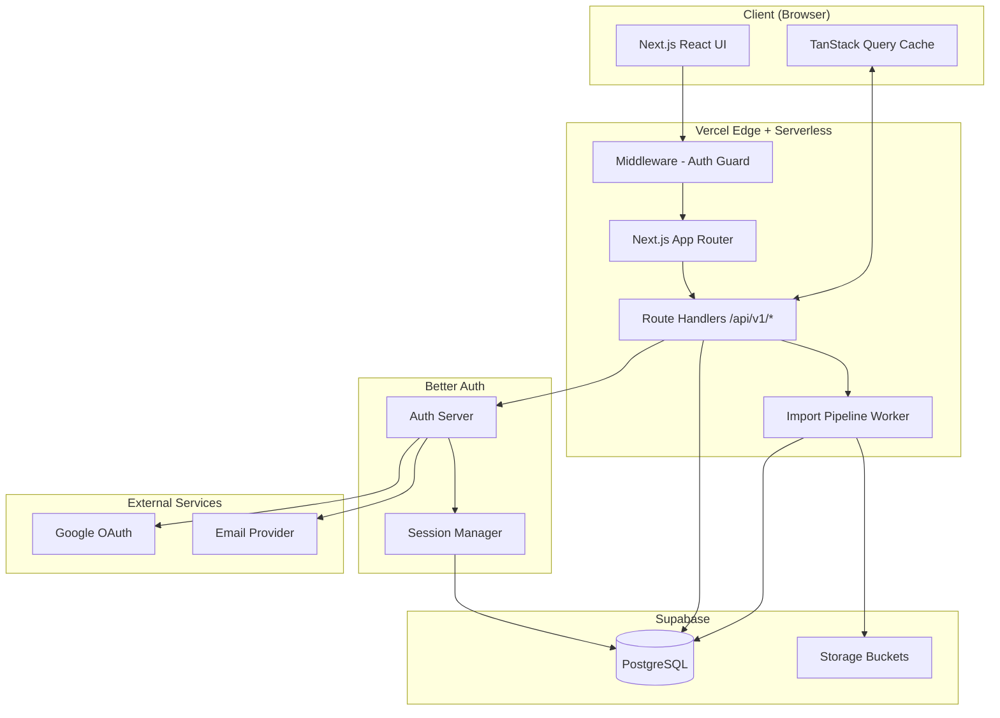
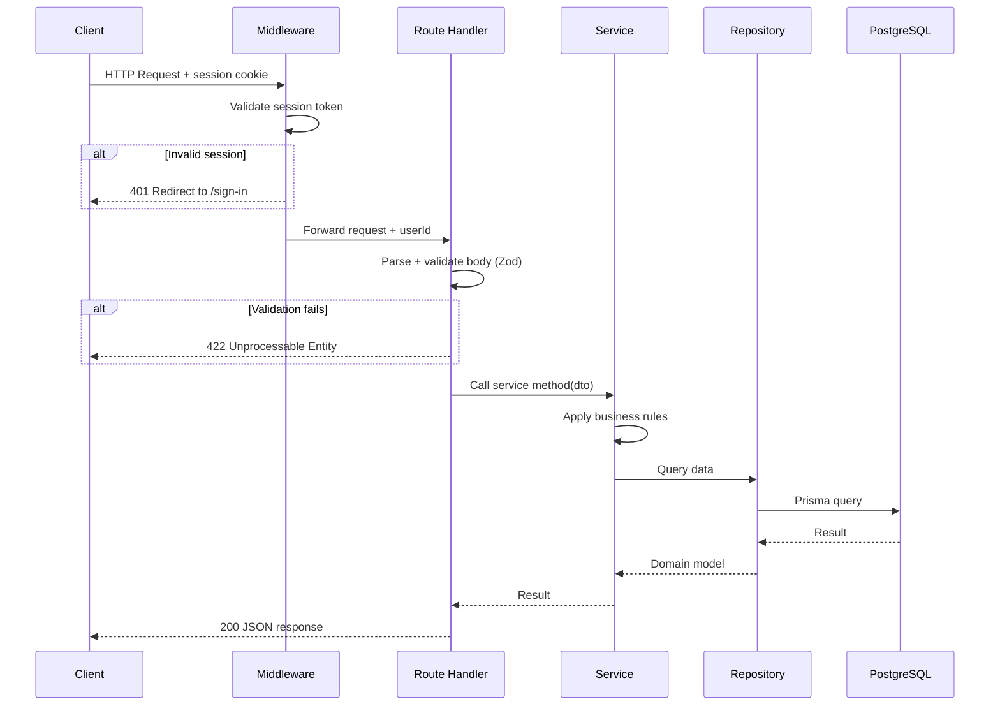
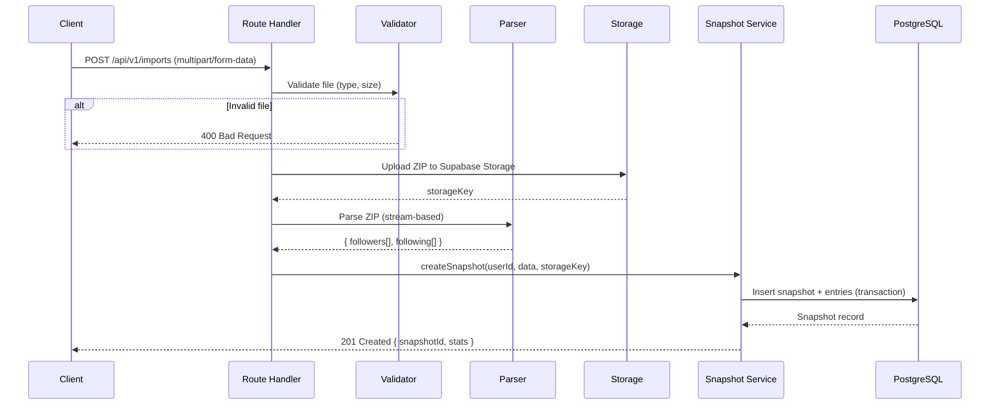

# 03 — System Architecture

> **FollowBack** · Instagram Relationship Intelligence Platform  
> Version 1.0 · Last Updated: 2026-07-09

---

## Table of Contents

1. [Architectural Philosophy](#1-architectural-philosophy)
2. [High-Level System Diagram](#2-high-level-system-diagram)
3. [Technology Stack](#3-technology-stack)
4. [Folder Structure](#4-folder-structure)
5. [Application Layers](#5-application-layers)
6. [Request Lifecycle](#6-request-lifecycle)
7. [Design Patterns](#7-design-patterns)
8. [State Management](#8-state-management)
9. [Caching Strategy](#9-caching-strategy)
10. [Error Handling](#10-error-handling)
11. [Logging & Observability](#11-logging--observability)
12. [Background Jobs](#12-background-jobs)
13. [File Storage Architecture](#13-file-storage-architecture)
14. [Scalability Considerations](#14-scalability-considerations)

---

## 1. Architectural Philosophy

FollowBack is built on four architectural pillars:

**1. Separation of Concerns**
Every layer has a single, well-defined responsibility. UI components do not contain business logic. API routes do not contain database queries. Services do not know about HTTP.

**2. Abstraction at Integration Points**
All external dependencies (database, storage, import providers, email, future payment providers) sit behind interfaces. Swapping a provider is a one-file change.

**3. Type Safety Everywhere**
TypeScript strict mode. Zod schemas at all I/O boundaries. Prisma-generated types for the database layer. No `any`. No `unknown` without explicit narrowing.

**4. Progressive Enhancement**
The application works without JavaScript for public pages. Private pages use React for interactivity but degrade gracefully on slow connections.

---

## 2. High-Level System Diagram



---

## 3. Technology Stack

### Core Runtime

| Layer | Technology | Version | Rationale |
|-------|-----------|---------|-----------|
| Framework | Next.js | 15.x | App Router, RSC, API Routes in one repo |
| Language | TypeScript | 5.x | End-to-end type safety |
| Runtime | Node.js | 22.x LTS | Stable, well-supported on Vercel |

### Frontend

| Concern | Technology | Notes |
|---------|-----------|-------|
| UI Framework | React | 19.x, with Server Components |
| Styling | Tailwind CSS | 4.x |
| Component Library | shadcn/ui | Radix UI primitives |
| Icons | Lucide React | Consistent icon set |
| Data Fetching | TanStack Query | Client-side cache, optimistic updates |
| Charts | Recharts | Follower trend charts |
| Forms | React Hook Form | With Zod resolver |
| Animations | Framer Motion | Subtle micro-animations |

### Backend

| Concern | Technology | Notes |
|---------|-----------|-------|
| API | Next.js Route Handlers | `/app/api/v1/` |
| ORM | Prisma | 5.x, with connection pooling via Supabase |
| Validation | Zod | Schema-first validation |
| Authentication | Better Auth | Self-hosted, email + Google OAuth |
| ZIP parsing | `adm-zip` | Server-side ZIP processing |
| File processing | Node.js streams | Memory-efficient for large exports |

### Infrastructure

| Concern | Technology | Notes |
|---------|-----------|-------|
| Hosting | Vercel | Free tier (Hobby), upgrade path clear |
| Database | Supabase PostgreSQL | Free tier; 500MB, 2 CPU, 1GB RAM |
| Storage | Supabase Storage | Free tier; 1GB |
| Connection Pooling | Supabase Pgbouncer | Transaction mode |
| CDN | Vercel Edge Network | Static assets + ISR |

### Quality

| Concern | Technology | Notes |
|---------|-----------|-------|
| Unit / Integration Tests | Vitest | Fast, ESM-native |
| E2E Tests | Playwright | Cross-browser |
| Linting | ESLint | With strict TypeScript rules |
| Formatting | Prettier | Opinionated, zero-config |
| CI/CD | GitHub Actions | Lint → Test → Deploy |
| Bundle Analysis | `@next/bundle-analyzer` | Run before each release |

---

## 4. Folder Structure

```
followback/
├── .github/
│   └── workflows/
│       ├── ci.yml                    # Lint + Test on PR
│       └── deploy.yml                # Deploy on merge to main
├── docs/                             # This specification
├── prisma/
│   ├── schema.prisma                 # Database schema
│   └── migrations/                   # Migration history
├── public/
│   ├── fonts/                        # Self-hosted fonts
│   └── images/                       # Static assets
├── src/
│   ├── app/                          # Next.js App Router
│   │   ├── (auth)/                   # Route group: unauthenticated pages
│   │   │   ├── sign-in/
│   │   │   ├── sign-up/
│   │   │   ├── forgot-password/
│   │   │   ├── reset-password/
│   │   │   └── verify-email/
│   │   ├── (marketing)/              # Route group: public marketing pages
│   │   │   └── page.tsx              # Landing page
│   │   ├── (app)/                    # Route group: authenticated app
│   │   │   ├── layout.tsx            # App shell (sidebar, header)
│   │   │   ├── dashboard/
│   │   │   ├── import/
│   │   │   │   ├── page.tsx
│   │   │   │   └── history/
│   │   │   ├── non-followers/
│   │   │   ├── non-following/
│   │   │   ├── mutuals/
│   │   │   ├── changes/
│   │   │   ├── onboarding/
│   │   │   └── settings/
│   │   │       ├── page.tsx
│   │   │       ├── profile/
│   │   │       └── data/
│   │   ├── api/
│   │   │   └── v1/                   # All API routes versioned
│   │   │       ├── auth/
│   │   │       │   └── [...all]/     # Better Auth catch-all
│   │   │       ├── imports/
│   │   │       ├── snapshots/
│   │   │       ├── users/
│   │   │       └── health/
│   │   ├── error.tsx                 # Global error boundary
│   │   ├── not-found.tsx
│   │   └── layout.tsx                # Root layout
│   ├── components/
│   │   ├── ui/                       # shadcn/ui components (do not edit)
│   │   ├── layout/                   # Sidebar, Header, Footer
│   │   ├── features/                 # Feature-specific components
│   │   │   ├── import/
│   │   │   ├── dashboard/
│   │   │   ├── followers/
│   │   │   └── diff/
│   │   └── shared/                   # Truly reusable across features
│   │       ├── DataTable/
│   │       ├── StatCard/
│   │       ├── EmptyState/
│   │       ├── LoadingSkeleton/
│   │       └── UserAvatar/
│   ├── lib/
│   │   ├── auth/
│   │   │   └── auth.ts               # Better Auth configuration
│   │   ├── db/
│   │   │   └── prisma.ts             # Prisma client singleton
│   │   ├── storage/
│   │   │   └── supabase-storage.ts   # Storage provider abstraction
│   │   ├── import/
│   │   │   ├── types.ts              # ImportProvider interface
│   │   │   ├── pipeline.ts           # Core import orchestrator
│   │   │   └── providers/
│   │   │       └── instagram-export/ # Instagram ZIP provider
│   │   │           ├── index.ts
│   │   │           ├── parser.ts
│   │   │           └── validator.ts
│   │   ├── diff/
│   │   │   └── snapshot-diff.ts      # Diff calculation algorithm
│   │   ├── validations/
│   │   │   ├── import.schema.ts
│   │   │   ├── user.schema.ts
│   │   │   └── snapshot.schema.ts
│   │   └── utils/
│   │       ├── cn.ts                 # clsx + tailwind-merge
│   │       ├── format.ts             # Date/number formatters
│   │       └── errors.ts             # Error factories
│   ├── hooks/
│   │   ├── use-snapshots.ts
│   │   ├── use-diff.ts
│   │   └── use-import.ts
│   ├── services/                     # Business logic layer
│   │   ├── import.service.ts
│   │   ├── snapshot.service.ts
│   │   ├── diff.service.ts
│   │   └── user.service.ts
│   ├── repositories/                 # Data access layer
│   │   ├── import.repository.ts
│   │   ├── snapshot.repository.ts
│   │   └── user.repository.ts
│   ├── types/
│   │   ├── api.ts                    # API request/response types
│   │   ├── domain.ts                 # Domain model types
│   │   └── next.d.ts                 # Next.js type augmentations
│   └── middleware.ts                 # Edge middleware (auth guard)
├── tests/
│   ├── unit/
│   ├── integration/
│   └── e2e/
├── .env.example
├── .env.local                        # Never committed
├── next.config.ts
├── tailwind.config.ts
├── tsconfig.json
├── vitest.config.ts
├── playwright.config.ts
├── package.json
└── README.md
```

---

## 5. Application Layers

The application follows a strict layered architecture. Dependencies flow downward only — upper layers depend on lower layers, never the reverse.

```
┌─────────────────────────────────────┐
│  UI Layer (React Components/Pages)  │  ← Renders data, handles user input
├─────────────────────────────────────┤
│  API Layer (Route Handlers)         │  ← HTTP, auth, input validation, response shaping
├─────────────────────────────────────┤
│  Service Layer                      │  ← Business logic, orchestration
├─────────────────────────────────────┤
│  Repository Layer                   │  ← Data access, query building
├─────────────────────────────────────┤
│  Infrastructure Layer               │  ← Prisma, Supabase client, external APIs
└─────────────────────────────────────┘
```

### Layer Responsibilities

**UI Layer** — React Server Components fetch data directly from the service layer in server context. Client Components use TanStack Query to call API routes. No business logic. No database calls.

**API Layer** — Route Handlers in `/app/api/v1/`. Responsibilities:
- Parse and validate request (Zod)
- Authenticate and authorise the request
- Call appropriate service method
- Shape and return HTTP response
- Handle and format errors

**Service Layer** — Pure TypeScript functions. Responsibilities:
- Enforce business rules
- Orchestrate across multiple repositories
- Handle transactions
- Emit events (future)

**Repository Layer** — Database access only. Responsibilities:
- Execute Prisma queries
- Map database records to domain types
- No business logic

**Infrastructure Layer** — External system clients (Prisma, Supabase storage client). Configured once, injected via module imports.

---

## 6. Request Lifecycle

### Authenticated API Request



### Import Request (file upload)



---

## 7. Design Patterns

### Repository Pattern

All database access goes through repository classes. Services never import Prisma directly.

```typescript
// repositories/snapshot.repository.ts
export interface SnapshotRepository {
  findById(id: string, userId: string): Promise<Snapshot | null>
  findAllByUserId(userId: string): Promise<Snapshot[]>
  create(data: CreateSnapshotInput): Promise<Snapshot>
  delete(id: string, userId: string): Promise<void>
}
```

### Service Pattern

Services contain business logic and are the only layer that calls repositories.

```typescript
// services/diff.service.ts
export class DiffService {
  constructor(private snapshotRepo: SnapshotRepository) {}

  async computeDiff(fromId: string, toId: string, userId: string): Promise<SnapshotDiff> {
    const [from, to] = await Promise.all([
      this.snapshotRepo.findById(fromId, userId),
      this.snapshotRepo.findById(toId, userId),
    ])
    if (!from || !to) throw new NotFoundError('Snapshot not found')
    return computeSetDiff(from.entries, to.entries)
  }
}
```

### Import Provider Interface (Strategy Pattern)

```typescript
// lib/import/types.ts
export interface ImportProvider {
  readonly name: string
  readonly version: string
  validate(input: ImportInput): Promise<ValidationResult>
  parse(input: ImportInput): Promise<ParsedFollowerData>
}

export interface ImportInput {
  file: Buffer | ReadableStream
  mimeType: string
  metadata?: Record<string, unknown>
}

export interface ParsedFollowerData {
  followers: FollowerEntry[]
  following: FollowerEntry[]
  exportedAt?: Date
  instagramUsername?: string
}
```

### Result Type for Error Handling

Avoid throwing exceptions across layer boundaries. Use a `Result` type:

```typescript
// lib/utils/result.ts
export type Result<T, E = Error> =
  | { success: true; data: T }
  | { success: false; error: E }

export const ok = <T>(data: T): Result<T> => ({ success: true, data })
export const err = <E>(error: E): Result<never, E> => ({ success: false, error })
```

---

## 8. State Management

FollowBack uses a **server-first** state approach:

| State Type | Solution | Where |
|-----------|----------|-------|
| Server data (snapshots, user profile) | React Server Components + TanStack Query | Fetched on server, hydrated on client |
| Mutations (import, delete) | TanStack Query mutations | Optimistic updates where safe |
| Form state | React Hook Form | Local to form component |
| UI state (modals, tabs, theme) | React `useState` / `useReducer` | Local component state |
| Global UI (theme, toast queue) | Zustand (minimal) | Only if truly global |

**Rule:** Do not use Zustand for server data. TanStack Query is the server data cache. Zustand is for ephemeral UI state only (e.g., sidebar open/closed, active modal).

### TanStack Query Key Convention

```typescript
export const queryKeys = {
  snapshots: {
    all: ['snapshots'] as const,
    byUser: (userId: string) => ['snapshots', userId] as const,
    detail: (id: string) => ['snapshots', 'detail', id] as const,
  },
  diff: {
    between: (fromId: string, toId: string) => ['diff', fromId, toId] as const,
  },
  user: {
    profile: ['user', 'profile'] as const,
  },
}
```

---

## 9. Caching Strategy

### Layer 1: HTTP Cache Headers

Public pages (landing, sign-in) use `Cache-Control: public, max-age=3600`. Authenticated pages: `Cache-Control: private, no-store`.

### Layer 2: Next.js Data Cache

Server Components use React `cache()` for deduplication within a request. `unstable_cache` is used for cross-request caching with tags.

```typescript
// Revalidated when the user's snapshots change
const getCachedSnapshots = unstable_cache(
  async (userId: string) => snapshotRepository.findAllByUserId(userId),
  ['user-snapshots'],
  { revalidate: 60, tags: ['snapshots'] }
)
```

### Layer 3: TanStack Query Client Cache

Client-side cache with `staleTime` and `gcTime` configuration:

```typescript
const queryClient = new QueryClient({
  defaultOptions: {
    queries: {
      staleTime: 30 * 1000,          // 30 seconds
      gcTime: 5 * 60 * 1000,         // 5 minutes
      retry: 2,
      refetchOnWindowFocus: false,
    },
  },
})
```

### Layer 4: Diff Result Caching

Computed diffs between snapshot pairs are stored in the database as a serialised JSON blob. This avoids recomputing the same diff on every request.

```
diff_cache table:
  from_snapshot_id + to_snapshot_id → cached JSON result
  invalidated when either snapshot is deleted
```

---

## 10. Error Handling

### Error Hierarchy

```typescript
// lib/utils/errors.ts

export class AppError extends Error {
  constructor(
    public readonly code: string,
    message: string,
    public readonly statusCode: number = 500,
    public readonly meta?: Record<string, unknown>
  ) {
    super(message)
    this.name = 'AppError'
  }
}

export class NotFoundError extends AppError {
  constructor(resource: string) {
    super('NOT_FOUND', `${resource} not found`, 404)
  }
}

export class ValidationError extends AppError {
  constructor(message: string, meta?: Record<string, unknown>) {
    super('VALIDATION_ERROR', message, 422, meta)
  }
}

export class UnauthorisedError extends AppError {
  constructor() {
    super('UNAUTHORISED', 'You must be signed in', 401)
  }
}

export class ForbiddenError extends AppError {
  constructor() {
    super('FORBIDDEN', 'You do not have permission to perform this action', 403)
  }
}

export class ImportParseError extends AppError {
  constructor(reason: string) {
    super('IMPORT_PARSE_ERROR', reason, 400)
  }
}
```

### API Error Response Format

All errors return a consistent JSON shape:

```json
{
  "error": {
    "code": "VALIDATION_ERROR",
    "message": "Invalid file format",
    "details": { "field": "file", "expected": "application/zip" }
  }
}
```

### Global Error Handler

```typescript
// lib/utils/api-handler.ts
export function withErrorHandler(
  handler: (req: NextRequest) => Promise<NextResponse>
) {
  return async (req: NextRequest): Promise<NextResponse> => {
    try {
      return await handler(req)
    } catch (error) {
      if (error instanceof AppError) {
        return NextResponse.json(
          { error: { code: error.code, message: error.message, details: error.meta } },
          { status: error.statusCode }
        )
      }
      // Unexpected errors — log and return 500
      logger.error('Unhandled error in API route', { error, path: req.url })
      return NextResponse.json(
        { error: { code: 'INTERNAL_ERROR', message: 'An unexpected error occurred' } },
        { status: 500 }
      )
    }
  }
}
```

### Client-Side Error Boundaries

- Root `error.tsx` catches rendering errors in the app shell
- Each feature route group has its own `error.tsx`
- TanStack Query `onError` callbacks show toast notifications

---

## 11. Logging & Observability

### Logging Levels

```typescript
// lib/utils/logger.ts
type LogLevel = 'debug' | 'info' | 'warn' | 'error'

interface LogContext {
  userId?: string
  requestId?: string
  path?: string
  duration?: number
  [key: string]: unknown
}

export const logger = {
  debug: (message: string, context?: LogContext) => log('debug', message, context),
  info:  (message: string, context?: LogContext) => log('info',  message, context),
  warn:  (message: string, context?: LogContext) => log('warn',  message, context),
  error: (message: string, context?: LogContext) => log('error', message, context),
}
```

### What to Log

| Event | Level | Required Context |
|-------|-------|-----------------|
| Request received | `debug` | method, path, userId |
| Import started | `info` | userId, fileSize |
| Import completed | `info` | userId, snapshotId, duration, followerCount |
| Import failed | `error` | userId, reason, fileSize |
| Diff computed | `debug` | fromId, toId, duration |
| User account deleted | `info` | userId (anonymised after deletion) |
| Auth failure | `warn` | ip, email (partial), reason |
| Unhandled error | `error` | full error + stack |

### Observability Stack (MVP)

- **Vercel Analytics** — page views, Web Vitals
- **Vercel Logs** — serverless function logs (structured JSON output)
- **Sentry** — client + server error tracking (free tier)

Production logs are structured JSON to enable future integration with Datadog, Grafana, or CloudWatch.

---

## 12. Background Jobs

v1.0 does not use a separate job queue. All processing is synchronous within the API route handler with appropriate timeout handling.

**Import processing** must complete within Vercel's 60-second serverless function limit. For large exports (10,000+ followers), processing is chunked into database batch inserts.

Future job queue considerations (v2.0+):
- Use **Vercel Cron** for scheduled tasks (weekly email digests)
- Use **Inngest** or **Trigger.dev** for durable background jobs (large import processing, email sending)
- The import pipeline is designed so it can be extracted into a background worker without changing the service layer interface

---

## 13. File Storage Architecture

### Storage Structure (Supabase Storage)

```
imports/
└── {userId}/
    └── {importId}/
        └── export.zip          ← Original uploaded ZIP (encrypted at rest)

(Future)
exports/
└── {userId}/
    └── {reportId}/
        └── report.csv
```

### Access Control

- All storage operations go through the API layer — users never get direct Supabase Storage URLs
- Signed URLs are generated server-side on demand (15-minute expiry) for any downloads
- Row-Level Security on Supabase is NOT used as the primary access control (API layer handles it) but is enabled as a defence-in-depth measure

### Retention Policy

- Import ZIPs are retained for 90 days after upload by default
- On snapshot deletion: corresponding ZIP is deleted immediately
- On account deletion: all ZIPs deleted within 24 hours

---

## 14. Scalability Considerations

### Database Scalability

- Supabase free tier handles ~500MB and ~100 connections (with pgbouncer pooling)
- Schema uses UUIDs for all primary keys (avoids hotspot issues on sequential IDs)
- `snapshot_entries` table will be the largest table; composite indexes ensure fast lookups
- For >100,000 followers per user: batch insert entries in chunks of 1,000

### API Scalability

- Vercel auto-scales serverless functions; no manual scaling needed for v1.0
- File uploads are streamed, not buffered, to avoid memory pressure

### Upgrade Path

When the Supabase free tier is insufficient:
1. Upgrade Supabase plan (zero code changes required — connection string only)
2. Enable Supabase read replicas for read-heavy queries
3. Add Redis (Upstash) for rate limiting and diff result caching
4. Move import processing to a dedicated background worker (Inngest)
5. Shard the `snapshot_entries` table by `user_id` if needed at extreme scale
