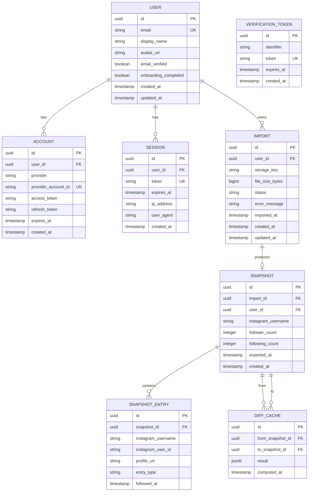

# 04 — Database Design

> **FollowBack** · Instagram Relationship Intelligence Platform  
> Version 1.0 · Last Updated: 2026-07-09

---

## Table of Contents

1. [Design Principles](#1-design-principles)
2. [Entity Relationship Diagram](#2-entity-relationship-diagram)
3. [Prisma Schema](#3-prisma-schema)
4. [Table Descriptions](#4-table-descriptions)
5. [Indexes](#5-indexes)
6. [Relationships](#6-relationships)
7. [Soft Delete vs Hard Delete](#7-soft-delete-vs-hard-delete)
8. [Migration Strategy](#8-migration-strategy)
9. [Seed Data](#9-seed-data)
10. [Future Schema Considerations](#10-future-schema-considerations)

---

## 1. Design Principles

- **UUID primary keys** everywhere — avoids sequential ID enumeration and supports future sharding
- **`created_at` / `updated_at`** on every table — mandatory for audit trail and debugging
- **Tenant isolation by `user_id`** — every query includes `userId` in the WHERE clause; never expose cross-user data
- **No soft deletes for user data** — GDPR requires actual deletion; hard deletes with cascade
- **Normalised but pragmatic** — `snapshot_entries` is a large flat table by design; JSON blobs used only for cached diff results
- **Explicit foreign key constraints** — always with `ON DELETE CASCADE` where child records are meaningless without parent

---

## 2. Entity Relationship Diagram



---

## 3. Prisma Schema

```prisma
// prisma/schema.prisma

generator client {
  provider = "prisma-client-js"
}

datasource db {
  provider  = "postgresql"
  url       = env("DATABASE_URL")
  directUrl = env("DIRECT_DATABASE_URL")
}

// ─────────────────────────────────────────────
// AUTH TABLES (managed by Better Auth)
// ─────────────────────────────────────────────

model User {
  id                   String    @id @default(uuid())
  email                String    @unique
  emailVerified        Boolean   @default(false)
  displayName          String
  avatarUrl            String?
  onboardingCompleted  Boolean   @default(false)
  createdAt            DateTime  @default(now())
  updatedAt            DateTime  @updatedAt

  // Relations
  accounts  Account[]
  sessions  Session[]
  imports   Import[]
  snapshots Snapshot[]

  @@map("users")
}

model Account {
  id                String   @id @default(uuid())
  userId            String
  provider          String   // "google" | "email"
  providerAccountId String
  accessToken       String?  @db.Text
  refreshToken      String?  @db.Text
  expiresAt         DateTime?
  createdAt         DateTime @default(now())

  user User @relation(fields: [userId], references: [id], onDelete: Cascade)

  @@unique([provider, providerAccountId])
  @@index([userId])
  @@map("accounts")
}

model Session {
  id        String   @id @default(uuid())
  userId    String
  token     String   @unique
  expiresAt DateTime
  ipAddress String?
  userAgent String?
  createdAt DateTime @default(now())

  user User @relation(fields: [userId], references: [id], onDelete: Cascade)

  @@index([userId])
  @@index([token])
  @@map("sessions")
}

model VerificationToken {
  id         String   @id @default(uuid())
  identifier String   // email address or userId
  token      String   @unique
  expiresAt  DateTime
  createdAt  DateTime @default(now())

  @@index([identifier])
  @@map("verification_tokens")
}

// ─────────────────────────────────────────────
// IMPORT TABLES
// ─────────────────────────────────────────────

enum ImportStatus {
  PENDING     // File uploaded, processing not started
  PROCESSING  // Currently being parsed
  COMPLETED   // Snapshot created successfully
  FAILED      // Processing failed
}

model Import {
  id             String       @id @default(uuid())
  userId         String
  storageKey     String       // Supabase Storage path to the ZIP file
  fileSizeBytes  BigInt
  status         ImportStatus @default(PENDING)
  errorMessage   String?
  importedAt     DateTime     @default(now())  // When the user initiated the import
  createdAt      DateTime     @default(now())
  updatedAt      DateTime     @updatedAt

  user     User      @relation(fields: [userId], references: [id], onDelete: Cascade)
  snapshot Snapshot?

  @@index([userId])
  @@index([userId, importedAt(sort: Desc)])
  @@map("imports")
}

model Snapshot {
  id                 String   @id @default(uuid())
  importId           String   @unique
  userId             String
  instagramUsername  String?  // Detected from the export data
  followerCount      Int
  followingCount     Int
  exportedAt         DateTime? // Timestamp from the Instagram export metadata
  createdAt          DateTime  @default(now())

  import       Import         @relation(fields: [importId], references: [id], onDelete: Cascade)
  user         User           @relation(fields: [userId], references: [id], onDelete: Cascade)
  entries      SnapshotEntry[]
  diffsFrom    DiffCache[]    @relation("DiffFrom")
  diffsTo      DiffCache[]    @relation("DiffTo")

  @@index([userId])
  @@index([userId, createdAt(sort: Desc)])
  @@map("snapshots")
}

enum EntryType {
  FOLLOWER   // This account follows the user
  FOLLOWING  // The user follows this account
}

model SnapshotEntry {
  id                  String    @id @default(uuid())
  snapshotId          String
  instagramUsername   String
  instagramUserId     String?   // Instagram's numeric user ID (may not be in export)
  profileUrl          String?
  entryType           EntryType
  followedAt          DateTime? // When the follow relationship was established (if in export)

  snapshot Snapshot @relation(fields: [snapshotId], references: [id], onDelete: Cascade)

  @@index([snapshotId])
  @@index([snapshotId, entryType])
  @@index([snapshotId, instagramUsername])
  @@map("snapshot_entries")
}

// ─────────────────────────────────────────────
// DIFF CACHE
// ─────────────────────────────────────────────

model DiffCache {
  id               String   @id @default(uuid())
  fromSnapshotId   String
  toSnapshotId     String
  result           Json     // Serialised DiffResult type
  computedAt       DateTime @default(now())

  fromSnapshot Snapshot @relation("DiffFrom", fields: [fromSnapshotId], references: [id], onDelete: Cascade)
  toSnapshot   Snapshot @relation("DiffTo",   fields: [toSnapshotId],   references: [id], onDelete: Cascade)

  @@unique([fromSnapshotId, toSnapshotId])
  @@index([fromSnapshotId])
  @@index([toSnapshotId])
  @@map("diff_cache")
}
```

---

## 4. Table Descriptions

### `users`
The core user identity record. One record per FollowBack account. Stores minimal PII: email and display name. Avatar URL points to an external URL (Google CDN or a default avatar service).

### `accounts`
OAuth provider account links. A user may have one email account and one Google account linked. Provider tokens are stored encrypted (see Security spec).

### `sessions`
Active session tokens. Better Auth manages this table. Sessions expire after 30 days (if "remember me") or on browser close (session cookie).

### `verification_tokens`
Used for email verification and password reset tokens. Tokens expire after 1 hour. Consumed on first use.

### `imports`
Tracks each file upload event. The `storageKey` is the Supabase Storage path to the uploaded ZIP. The `status` enum tracks the processing lifecycle. Failed imports retain their record (with `errorMessage`) for debugging, but the associated storage file is deleted.

### `snapshots`
A point-in-time record of the user's Instagram relationship state. One snapshot per import. The `followerCount` and `followingCount` are denormalised from the parsed data for fast dashboard queries without counting entries.

### `snapshot_entries`
The largest table. Each row represents one follow relationship at the time of a snapshot — either a follower or a following. For a user with 5,000 followers and 5,000 following and 10 snapshots: 100,000 rows. This is well within PostgreSQL's performance range with proper indexing.

**Row estimate formula:** `total_rows = sum_across_users(snapshot_count * (follower_count + following_count))`

For the first 10,000 users with average 2,000 social connections and average 3 snapshots: ~60 million rows. This is the table that will drive partitioning decisions at scale (see section 10).

### `diff_cache`
Stores computed diffs as JSON to avoid recomputation. The `result` JSON matches the `DiffResult` TypeScript interface defined in the diff service. Invalidated (deleted) whenever either referenced snapshot is deleted.

---

## 5. Indexes

### Primary Indexes (auto-created by PK)
All tables have `id` as UUID primary key with a btree index.

### Critical Query Indexes

```sql
-- Most common query: fetch all snapshots for a user, newest first
CREATE INDEX idx_snapshots_user_created 
  ON snapshots(user_id, created_at DESC);

-- Fetch entries for a snapshot, filtered by type
CREATE INDEX idx_snapshot_entries_snapshot_type 
  ON snapshot_entries(snapshot_id, entry_type);

-- Search entries by username within a snapshot
CREATE INDEX idx_snapshot_entries_username 
  ON snapshot_entries(snapshot_id, instagram_username);

-- Find active sessions for a user
CREATE INDEX idx_sessions_user 
  ON sessions(user_id);

-- Token lookups (auth)
CREATE INDEX idx_sessions_token 
  ON sessions(token);

-- Import history for a user
CREATE INDEX idx_imports_user_date 
  ON imports(user_id, imported_at DESC);

-- Diff cache lookups
CREATE INDEX idx_diff_cache_from 
  ON diff_cache(from_snapshot_id);
CREATE INDEX idx_diff_cache_to 
  ON diff_cache(to_snapshot_id);
```

### Text Search (Future)

For username search at scale, consider adding a GIN index with pg_trgm:

```sql
-- Requires: CREATE EXTENSION pg_trgm;
CREATE INDEX idx_snapshot_entries_username_gin 
  ON snapshot_entries USING gin(instagram_username gin_trgm_ops);
```

For MVP, client-side filtering on paginated results is sufficient.

---

## 6. Relationships

| Parent | Child | Cardinality | On Delete |
|--------|-------|-------------|-----------|
| User | Account | 1:N | Cascade |
| User | Session | 1:N | Cascade |
| User | Import | 1:N | Cascade |
| User | Snapshot | 1:N | Cascade |
| Import | Snapshot | 1:1 | Cascade |
| Snapshot | SnapshotEntry | 1:N | Cascade |
| Snapshot (from) | DiffCache | 1:N | Cascade |
| Snapshot (to) | DiffCache | 1:N | Cascade |

All cascades mean: deleting a user deletes everything. Deleting a snapshot deletes all its entries and all diff caches that reference it.

---

## 7. Soft Delete vs Hard Delete

**Decision: Hard deletes everywhere.**

Rationale:
- GDPR Article 17 (Right to Erasure) requires actual deletion
- Follower data is sensitive — users must be able to trust it is gone
- No business case for recovering deleted data in v1.0

For future audit requirements (v2.0+), a separate `audit_log` table can track deletion events without retaining the deleted data itself:

```prisma
// Future only
model AuditLog {
  id         String   @id @default(uuid())
  userId     String   // May be deleted by this point — store as plain string
  action     String   // "snapshot_deleted", "account_deleted", etc.
  metadata   Json
  createdAt  DateTime @default(now())

  @@index([userId])
  @@map("audit_logs")
}
```

---

## 8. Migration Strategy

### Tools
Prisma Migrate for schema management. All migrations are versioned and committed to source control.

### Workflow

```bash
# Development: create and apply migration
npx prisma migrate dev --name describe_what_changed

# Production: apply pending migrations (run in CI/CD)
npx prisma migrate deploy

# Inspect current state
npx prisma migrate status

# Reset dev database (NEVER in production)
npx prisma migrate reset
```

### Rules

1. **Never edit an existing migration file** — create a new migration for any change
2. **Every migration is reviewed in PR** — include schema diff in PR description
3. **Additive first** — add nullable columns before making them required; drop columns in a subsequent migration after code is deployed
4. **Data migrations are separate files** — schema migrations and data transformations are not mixed
5. **Test on staging before production** — staging database mirrors production schema

### Initial Migration Sequence

```
0001_initial_auth_tables.sql         -- users, accounts, sessions, verification_tokens
0002_imports_and_snapshots.sql       -- imports, snapshots, snapshot_entries
0003_diff_cache.sql                  -- diff_cache
0004_indexes.sql                     -- all critical indexes
0005_seed_dev.sql                    -- development seed data (not run in production)
```

---

## 9. Seed Data

Development seed data is created via `prisma/seed.ts`:

```typescript
// prisma/seed.ts
// Creates:
//   - 2 test users (alice@test.com, bob@test.com, password: "TestPass1!")
//   - 3 snapshots for alice (spread across 30 days)
//   - ~500 follower/following entries per snapshot
//   - 2 diff_cache entries for alice's snapshots
```

Seed data is applied via `npx prisma db seed` and is excluded from production deployments via `package.json` prisma seed script guards.

---

## 10. Future Schema Considerations

### Multi-Account Support

When a user can manage multiple Instagram accounts:

```prisma
// Add to schema
model InstagramAccount {
  id               String     @id @default(uuid())
  userId           String
  instagramUsername String
  displayName      String?
  isDefault        Boolean    @default(false)
  createdAt        DateTime   @default(now())

  user      User       @relation(fields: [userId], references: [id], onDelete: Cascade)
  snapshots Snapshot[]
}
```

The `Snapshot` model would gain an `instagramAccountId` foreign key.

### Subscription Plans

```prisma
enum PlanType { FREE PRO TEAM }

model Subscription {
  id              String   @id @default(uuid())
  userId          String   @unique
  plan            PlanType @default(FREE)
  stripeCustomerId String?
  stripeSubId     String?
  currentPeriodEnd DateTime?
  createdAt       DateTime @default(now())
  updatedAt       DateTime @updatedAt

  user User @relation(fields: [userId], references: [id], onDelete: Cascade)
}
```

### Table Partitioning (at scale)

When `snapshot_entries` exceeds 100 million rows, partition by `user_id` hash:

```sql
CREATE TABLE snapshot_entries (
  ...
) PARTITION BY HASH (snapshot_id);

CREATE TABLE snapshot_entries_0 PARTITION OF snapshot_entries
  FOR VALUES WITH (MODULUS 4, REMAINDER 0);
-- etc.
```

This is not needed for MVP but should be considered when designing indexes to ensure they are partition-compatible.
