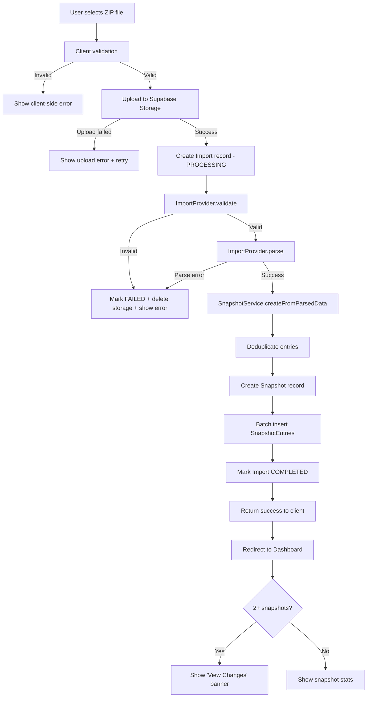

# 08 — Import System

> **FollowBack** · Instagram Relationship Intelligence Platform  
> Version 1.0 · Last Updated: 2026-07-09

---

## Table of Contents

1. [System Overview](#1-system-overview)
2. [Import Provider Abstraction](#2-import-provider-abstraction)
3. [Instagram Export Provider](#3-instagram-export-provider)
4. [File Validation Pipeline](#4-file-validation-pipeline)
5. [Parsing Instagram Export JSON](#5-parsing-instagram-export-json)
6. [Snapshot Storage](#6-snapshot-storage)
7. [Diff Calculation](#7-diff-calculation)
8. [Error Recovery](#8-error-recovery)
9. [Adding a New Import Provider](#9-adding-a-new-import-provider)
10. [Future Providers](#10-future-providers)

---

## 1. System Overview

The Import System is the core value-creating subsystem of FollowBack. It transforms raw user data (an Instagram export ZIP) into structured, queryable Snapshot records, and computes meaningful diffs between snapshots over time.

### High-Level Flow



---

## 2. Import Provider Abstraction

The import system uses a **Provider Pattern** (a form of the Strategy Pattern) to decouple the core pipeline from any specific data source.

### Core Interfaces

```typescript
// lib/import/types.ts

/**
 * The input given to an import provider.
 * Designed to accommodate multiple data source formats.
 */
export interface ImportInput {
  /** Raw file buffer */
  buffer: Buffer
  /** MIME type of the uploaded file */
  mimeType: string
  /** Original filename (for logging/debugging) */
  originalFilename?: string
  /** Provider-specific configuration */
  metadata?: Record<string, unknown>
}

/**
 * The result of parsing any import source.
 * All providers must return this shape.
 */
export interface ParsedFollowerData {
  /** List of accounts that follow the user */
  followers: FollowerEntry[]
  /** List of accounts the user follows */
  following: FollowerEntry[]
  /** When Instagram generated the export (if available) */
  exportedAt?: Date
  /** The Instagram username this export belongs to (if detectable) */
  instagramUsername?: string
  /** Which provider produced this data */
  providerName: string
  /** Provider format version for compatibility tracking */
  providerVersion: string
}

export interface FollowerEntry {
  instagramUsername: string
  instagramUserId?: string
  profileUrl?: string
  followedAt?: Date
}

export interface ValidationResult {
  valid: boolean
  reason?: string         // Human-readable failure message
  formatVersion?: string  // Detected format version
}

/**
 * The contract every import provider must implement.
 * Adding a new data source = implementing this interface.
 */
export interface ImportProvider {
  /** Unique identifier for this provider */
  readonly name: string
  /** Human-readable display name */
  readonly displayName: string
  /** Current implementation version */
  readonly version: string

  /**
   * Validates that the input is a supported format for this provider.
   * Fast check — does not parse all data.
   */
  validate(input: ImportInput): Promise<ValidationResult>

  /**
   * Parses the input and returns structured follower data.
   * Only called after validate() returns { valid: true }.
   */
  parse(input: ImportInput): Promise<ParsedFollowerData>
}
```

### Provider Registry

```typescript
// lib/import/registry.ts

const providers: Map<string, ImportProvider> = new Map()

export function registerProvider(provider: ImportProvider): void {
  if (providers.has(provider.name)) {
    throw new Error(`Provider '${provider.name}' is already registered`)
  }
  providers.set(provider.name, provider)
}

export function getProvider(name: string): ImportProvider {
  const provider = providers.get(name)
  if (!provider) throw new Error(`Unknown import provider: '${name}'`)
  return provider
}

export function getDefaultProvider(): ImportProvider {
  return getProvider('instagram-export-v1')
}

// Registration at startup
import { InstagramExportProvider } from './providers/instagram-export'
registerProvider(new InstagramExportProvider())
```

---

## 3. Instagram Export Provider

The v1.0 provider handles ZIP files downloaded from Instagram's native data export feature.

### Instagram Export Format

When a user requests their data from Instagram (JSON format), they receive a ZIP file with the following structure:

```
your_instagram_activity/
└── followers_and_following/
    ├── followers_1.json          ← Primary followers file
    ├── followers_2.json          ← Overflow if >1000 followers (paginated)
    ├── following.json            ← People the user follows
    └── (other files not needed by FollowBack)
```

**`followers_1.json` format:**
```json
[
  {
    "title": "",
    "media_list_data": [],
    "string_list_data": [
      {
        "href": "https://www.instagram.com/example_user/",
        "value": "example_user",
        "timestamp": 1704067200
      }
    ]
  }
]
```

**`following.json` format:** Identical structure to `followers_1.json`.

### Provider Implementation

```typescript
// lib/import/providers/instagram-export/index.ts

export class InstagramExportProvider implements ImportProvider {
  readonly name = 'instagram-export-v1'
  readonly displayName = 'Instagram Data Export'
  readonly version = '1.0.0'

  async validate(input: ImportInput): Promise<ValidationResult> {
    // 1. Check magic bytes (ZIP signature: PK\x03\x04)
    if (!isZipFile(input.buffer)) {
      return { valid: false, reason: 'File is not a ZIP archive' }
    }

    // 2. Open ZIP and inspect contents
    const zip = new AdmZip(input.buffer)
    const entries = zip.getEntries().map(e => e.entryName)

    // 3. Check for required files (account for nested folder structure)
    const hasFollowers = entries.some(e => /followers_1\.json$/i.test(e))
    const hasFollowing = entries.some(e => /following\.json$/i.test(e))

    if (!hasFollowers || !hasFollowing) {
      // Check for HTML format (common mistake)
      const hasHtmlFollowers = entries.some(e => /followers\.html$/i.test(e))
      if (hasHtmlFollowers) {
        return {
          valid: false,
          reason: 'This is an HTML export. Please re-download your Instagram data and select JSON format.',
        }
      }
      return {
        valid: false,
        reason: 'This does not appear to be an Instagram data export. Required files (followers_1.json, following.json) were not found.',
      }
    }

    // 4. Check for executable files (security)
    const hasExecutable = entries.some(e => /\.(exe|sh|bat|cmd|ps1|py|js|ts)$/i.test(e))
    if (hasExecutable) {
      return { valid: false, reason: 'The ZIP contains executable files and cannot be processed.' }
    }

    return { valid: true, formatVersion: this.detectFormatVersion(entries) }
  }

  async parse(input: ImportInput): Promise<ParsedFollowerData> {
    const zip = new AdmZip(input.buffer)

    // Parse all followers files (paginated: followers_1.json, followers_2.json, ...)
    const followers = await this.parseFollowerFiles(zip)

    // Parse following file
    const following = await this.parseFollowingFile(zip)

    // Attempt to detect Instagram username from following data
    // (not reliably available in all export versions)
    const instagramUsername = undefined  // Cannot reliably detect from export structure

    return {
      followers,
      following,
      exportedAt: this.detectExportDate(zip),
      instagramUsername,
      providerName: this.name,
      providerVersion: this.version,
    }
  }

  private async parseFollowerFiles(zip: AdmZip): Promise<FollowerEntry[]> {
    const entries: FollowerEntry[] = []
    let pageNum = 1

    while (true) {
      const entry = zip.getEntry(
        this.findPath(zip, `followers_${pageNum}.json`)
      )
      if (!entry) break

      const data = this.parseFollowerJson(entry.getData().toString('utf8'))
      entries.push(...data)
      pageNum++
    }

    return entries
  }

  private parseFollowerJson(jsonString: string): FollowerEntry[] {
    const raw = JSON.parse(jsonString) as InstagramFollowerRecord[]
    return raw.flatMap(record =>
      record.string_list_data.map(item => ({
        instagramUsername: item.value,
        profileUrl: item.href,
        followedAt: item.timestamp ? new Date(item.timestamp * 1000) : undefined,
      }))
    )
  }

  private parseFollowingFile(zip: AdmZip): FollowerEntry[] {
    const entryPath = this.findPath(zip, 'following.json')
    const entry = zip.getEntry(entryPath)
    if (!entry) throw new ImportParseError('following.json not found in ZIP')

    // Following has a different top-level structure
    const raw = JSON.parse(entry.getData().toString('utf8')) as InstagramFollowingRecord
    const items = raw.relationships_following ?? raw  // Handle format variants

    return items.flatMap((record: InstagramFollowerRecord) =>
      record.string_list_data.map(item => ({
        instagramUsername: item.value,
        profileUrl: item.href,
        followedAt: item.timestamp ? new Date(item.timestamp * 1000) : undefined,
      }))
    )
  }

  /**
   * Find a file path in the ZIP regardless of folder depth.
   * Instagram ZIPs may or may not include a root folder.
   */
  private findPath(zip: AdmZip, filename: string): string {
    const entry = zip.getEntries().find(e => e.entryName.endsWith(filename))
    return entry?.entryName ?? filename
  }

  private detectExportDate(zip: AdmZip): Date | undefined {
    // Instagram doesn't include an explicit export timestamp.
    // Use the last modified time of the ZIP's first entry as a proxy.
    const firstEntry = zip.getEntries()[0]
    if (firstEntry?.header.time) {
      return new Date(firstEntry.header.time)
    }
    return undefined
  }

  private detectFormatVersion(entries: string[]): string {
    // Future: detect format differences and return version string
    return 'v2024'
  }
}

// Raw Instagram JSON types
interface InstagramFollowerRecord {
  title: string
  string_list_data: Array<{
    href: string
    value: string
    timestamp: number
  }>
}

interface InstagramFollowingRecord {
  relationships_following?: InstagramFollowerRecord[]
}
```

---

## 4. File Validation Pipeline

Validation runs in two stages:

### Stage 1: Client-Side (immediate feedback)

```typescript
// components/features/import/FileDropzone.tsx

function validateFile(file: File): string | null {
  // Type check
  if (!['application/zip', 'application/x-zip-compressed', 'application/octet-stream'].includes(file.type)) {
    // Also check extension as fallback (MIME type unreliable on some OSes)
    if (!file.name.toLowerCase().endsWith('.zip')) {
      return 'Please upload a ZIP file'
    }
  }

  // Size check
  if (file.size > 50 * 1024 * 1024) {
    return `File is too large (${formatBytes(file.size)}). Maximum size is 50MB`
  }

  if (file.size < 100) {
    return 'File appears to be empty or invalid'
  }

  return null  // Valid
}
```

### Stage 2: Server-Side (comprehensive)

```typescript
// In ImportService.processUpload:

// Check 1: Magic bytes (real ZIP check, not just extension)
function isZipFile(buffer: Buffer): boolean {
  // ZIP magic bytes: PK (0x50 0x4B 0x03 0x04)
  return buffer[0] === 0x50 && buffer[1] === 0x4B && buffer[2] === 0x03 && buffer[3] === 0x04
}

// Check 2: Maximum individual file size within ZIP
function checkZipEntrySize(zip: AdmZip): boolean {
  const MAX_ENTRY_SIZE = 10 * 1024 * 1024  // 10MB per file
  return zip.getEntries().every(entry => entry.header.size <= MAX_ENTRY_SIZE)
}

// Check 3: Zip bomb detection (compression ratio)
function checkCompressionRatio(zip: AdmZip, originalSize: number): boolean {
  const totalUncompressed = zip.getEntries().reduce((sum, e) => sum + e.header.size, 0)
  const ratio = totalUncompressed / originalSize
  return ratio < 100  // Reject if > 100x compression ratio
}

// Check 4: File count limit
function checkFileCount(zip: AdmZip): boolean {
  return zip.getEntries().length <= 10000
}
```

---

## 5. Parsing Instagram Export JSON

### Format Stability

Instagram's export format has changed over the years. The parser must handle known variants:

| Year | Format Change |
|------|--------------|
| 2021–2023 | `followers_1.json` in root, `following.json` nested |
| 2024+ | Both files nested under `your_instagram_activity/followers_and_following/` |
| All | `following.json` has a wrapper object key (`relationships_following`) |
| Some | Direct array (no wrapper key) |

### Defensive Parsing

```typescript
function safeParseJson<T>(input: string, context: string): T {
  try {
    return JSON.parse(input) as T
  } catch (e) {
    throw new ImportParseError(`Failed to parse ${context}: ${(e as Error).message}`)
  }
}

function extractEntries(data: unknown): FollowerEntry[] {
  // Handle both array (followers) and wrapped object (following)
  const records = Array.isArray(data)
    ? data
    : (data as { relationships_following?: unknown[] }).relationships_following ?? []

  if (!Array.isArray(records)) {
    throw new ImportParseError('Unexpected data structure in export file')
  }

  return records.flatMap((record) => {
    if (!record || typeof record !== 'object') return []
    const stringListData = (record as { string_list_data?: unknown[] }).string_list_data
    if (!Array.isArray(stringListData)) return []

    return stringListData
      .filter((item) => item && typeof item === 'object' && typeof (item as { value?: string }).value === 'string')
      .map((item) => {
        const i = item as { value: string; href?: string; timestamp?: number }
        return {
          instagramUsername: i.value,
          profileUrl: i.href,
          followedAt: i.timestamp ? new Date(i.timestamp * 1000) : undefined,
        }
      })
  })
}
```

---

## 6. Snapshot Storage

### Deduplication

Before storing entries, the parser deduplicates by `instagramUsername` (lowercase):

```typescript
function deduplicateEntries(entries: FollowerEntry[]): FollowerEntry[] {
  const seen = new Set<string>()
  return entries.filter(entry => {
    const key = entry.instagramUsername.toLowerCase()
    if (seen.has(key)) return false
    seen.add(key)
    return true
  })
}
```

### Batch Insert Strategy

For large follow lists (10,000+ entries), inserting one-at-a-time would be unacceptably slow. Batch insert with `createMany`:

```typescript
const BATCH_SIZE = 1000

async function insertEntriesInBatches(
  tx: PrismaTransactionClient,
  snapshotId: string,
  entries: EntryInput[],
): Promise<void> {
  for (let i = 0; i < entries.length; i += BATCH_SIZE) {
    const batch = entries.slice(i, i + BATCH_SIZE)
    await tx.snapshotEntry.createMany({
      data: batch.map(e => ({ ...e, snapshotId })),
    })
  }
}
```

**Performance benchmarks (target):**
- 1,000 entries: < 500ms
- 5,000 entries: < 2s
- 20,000 entries: < 8s
- 100,000 entries: < 45s

---

## 7. Diff Calculation

See `07_BACKEND.md` Section 4 for the algorithm. The diff system interacts with the import system as follows:

1. After a new snapshot is created, the API response includes `snapshotId`
2. The client uses this to check if a previous snapshot exists
3. If it does, the "View Changes" CTA links to `/changes?from={prev}&to={new}`
4. The diff is computed lazily (on first request) and cached in `diff_cache`

### Cache Invalidation

```typescript
// When a snapshot is deleted:
// 1. Prisma FK cascade deletes diff_cache records where from_snapshot_id = deletedId
// 2. Prisma FK cascade deletes diff_cache records where to_snapshot_id = deletedId
// No manual cache invalidation needed.
```

---

## 8. Error Recovery

| Failure Point | Action |
|--------------|--------|
| Client-side validation fails | Show error immediately; no upload attempt |
| Storage upload fails | Show retry button; no database record created |
| ZIP validation fails | Mark import FAILED; delete storage file; show specific error |
| JSON parsing fails | Mark import FAILED; delete storage file; show "Invalid export" error |
| Database insert fails | Mark import FAILED; delete storage file; log error |
| Partial batch insert (crash mid-insert) | Incomplete snapshot record + entries exist → cleaned up by scheduled maintenance task (v2.0) or detected by `followerCount` mismatch |

### Orphan Cleanup (Future v2.0)

A scheduled job (Vercel Cron, daily) checks for:
- Imports stuck in `PROCESSING` state > 10 minutes → mark FAILED
- Storage files with no corresponding import record → delete
- Snapshot entries count mismatch with `followerCount` → flag for review

---

## 9. Adding a New Import Provider

To add a new import provider (e.g., a future Meta API integration or a CSV-based provider), follow these steps:

**Step 1: Implement the interface**

```typescript
// lib/import/providers/meta-api-v2/index.ts

import type { ImportProvider, ImportInput, ParsedFollowerData, ValidationResult } from '../../types'

export class MetaApiProvider implements ImportProvider {
  readonly name = 'meta-api-v2'
  readonly displayName = 'Meta Graph API'
  readonly version = '1.0.0'

  async validate(input: ImportInput): Promise<ValidationResult> {
    // Validate that the input looks like a Meta API response
    // ...
    return { valid: true }
  }

  async parse(input: ImportInput): Promise<ParsedFollowerData> {
    // Parse the Meta API response format into ParsedFollowerData
    // ...
    return {
      followers: [],
      following: [],
      providerName: this.name,
      providerVersion: this.version,
    }
  }
}
```

**Step 2: Register the provider**

```typescript
// lib/import/registry.ts — add one line:
import { MetaApiProvider } from './providers/meta-api-v2'
registerProvider(new MetaApiProvider())
```

**Step 3: Wire up the UI**

Add a new import method card to the Import page. The card triggers the same import pipeline but specifies `providerName: 'meta-api-v2'` in the request.

**Step 4: Update the API route**

The import API route reads the `provider` field from the request body (or defaults to `instagram-export-v1`):

```typescript
const provider = getProvider(body.provider ?? 'instagram-export-v1')
```

**Nothing else changes.** The snapshot creation, storage, diff calculation, and dashboard are all provider-agnostic.

---

## 10. Future Providers

| Provider | Trigger | Expected Format |
|---------|---------|----------------|
| `meta-api-v3` | Meta opens follower API | JSON via OAuth token |
| `instagram-export-v2` | Instagram changes export format | Updated ZIP structure |
| `csv-manual` | User manually exports and formats data | Structured CSV with username column |
| `browser-extension` | FollowBack Chrome extension | JSON posted from extension content script |
| `instagram-scraper` | If ToS-compliant method exists | HTML → parsed to JSON |

Each future provider is a new file implementing `ImportProvider`. The core pipeline, storage, and diff logic never change.
